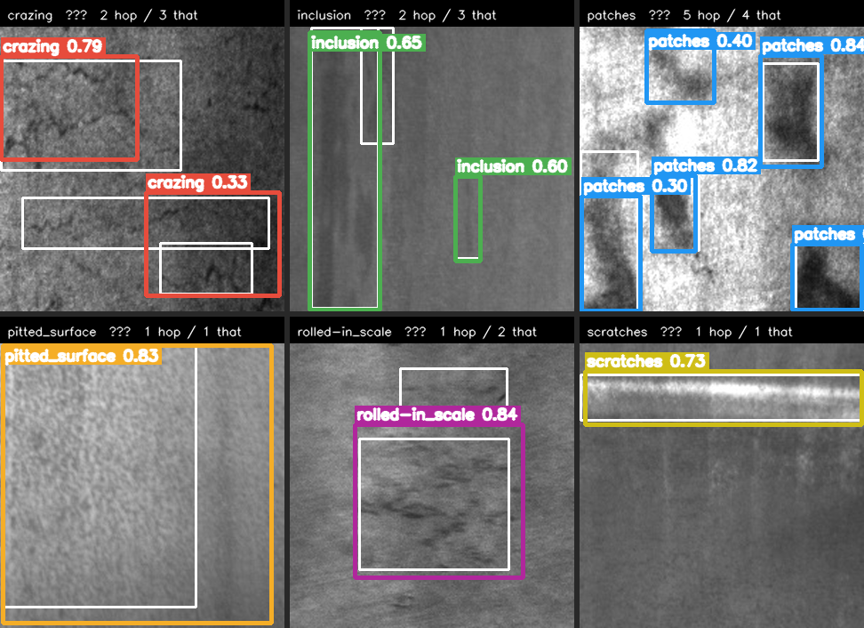

# IVID — Industrial Visual Inspection & Deployment Benchmark

Phát hiện lỗi bề mặt thép cán nóng (NEU-DET, 6 lớp) bằng YOLO, rồi **đo hiệu năng
trên ba runtime** — PyTorch / ONNX Runtime / TensorRT FP16 — trên NVIDIA Jetson Orin Nano,
và đóng gói thành dịch vụ REST.

Phần lớn project dừng ở "train xong, mAP bao nhiêu". Cái đáng giá ở đây là câu trả lời cho
câu hỏi của người triển khai: **chọn định dạng nào để chạy trên dây chuyền, đánh đổi bao
nhiêu độ chính xác lấy tốc độ, và có kịp nhịp sản xuất không.**

## Kết quả

<!-- IVID_TABLE_START -->
| Model | Runtime | mAP@0.5 | mAP@0.5:0.95 | p50 (ms) | p95 (ms) | FPS | Model size | Bộ nhớ tăng thêm |
|---|---|---:|---:|---:|---:|---:|---:|---:|
| yolov8n | PyTorch | 0.7317 | 0.3547 | 34.27 | 34.69 | 29.2 | 6.3 MB | 7 MB |
| yolov8n | ONNX Runtime | 0.7356 | 0.3549 | 18.51 | 18.70 | 54.0 | 12.3 MB | 7 MB |
| yolov8n | TensorRT FP16 | 0.7357 | 0.3553 | 14.19 | 14.51 | 70.5 | 9.0 MB | 31 MB |
| yolov8s | PyTorch | 0.7270 | 0.3335 | 42.79 | 43.04 | 23.4 | 22.5 MB | 32 MB |
| yolov8s | ONNX Runtime | 0.7271 | 0.3331 | 28.36 | 28.58 | 35.3 | 44.8 MB | 6 MB |
| yolov8s | TensorRT FP16 | 0.7270 | 0.3332 | 18.36 | 18.83 | 54.5 | 25.6 MB | 15 MB |


<!-- IVID_TABLE_END -->

**Đã kiểm chứng chuỗi export trên phần cứng thật** (YOLOv8n pretrained, 640×640, chỉ inference thuần, Jetson @15W):

| ONNX opset | Engine | p50 | FPS |
|---|---:|---:|---:|
| 12 | 9.0 MB | 7.13 ms | 140 |
| 17 | 9.0 MB | **6.25 ms** | **160** |

`.pt → .onnx → .engine (FP16)` chạy thông trên TensorRT 10.3 / CUDA 12.6 — rủi ro lớn nhất
của dự án (xung đột phiên bản JetPack ↔ TensorRT ↔ ONNX opset) đã được loại bỏ từ ngày đầu.

### Model nhìn thấy gì



Mỗi lớp một ảnh, chạy bằng engine TensorRT FP16. **Hộp màu** là dự đoán kèm điểm tin cậy,
**hộp trắng mảnh** là nhãn thật. Sinh bằng `make demo-images` — ảnh được chọn tất định
(ảnh test đầu tiên chỉ chứa đúng lớp đó) nên chạy lại trên máy khác cho ra đúng hình này.

## Phần cứng đích

| | |
|---|---|
| Thiết bị | Jetson Orin Nano 8GB |
| JetPack / L4T | 6.2 / R36.5.2 |
| CUDA / TensorRT | 12.6.68 / 10.3.0.30 |
| PyTorch | 2.10.0 (bản NVIDIA, CUDA) |
| Python | 3.10.12 |
| Chế độ nguồn có sẵn | 15W · 25W · MAXN_SUPER |

## Quick start

```bash
bash scripts/setup_jetson.sh      # dựng venv (không phá torch CUDA của NVIDIA)
make data                         # tải NEU-DET + chuẩn bị + kiểm tra + thống kê
make export-onnx && make export-trt
make bench && make accuracy && make report
```

`make help` liệt kê toàn bộ lệnh.

Train: mở [`notebooks/ivid_colab.ipynb`](https://colab.research.google.com/github/quocanh112233/industrial-visual-inspection/blob/main/notebooks/ivid_colab.ipynb) trong Google Colab (cần repo public, hoặc dùng token — notebook có hướng dẫn cả hai). Giải thích chi tiết ở [docs/colab-training.md](docs/colab-training.md).

## Dữ liệu

NEU-DET — 1800 ảnh xám 200×200, 4189 bounding box thô (**4186** sau khi loại 3 hộp
trùng lặp), 6 loại lỗi:
`crazing`, `inclusion`, `patches`, `pitted_surface`, `rolled-in_scale`, `scratches`.

Chia 70/15/15 phân tầng theo lớp, seed `1337`, chạy lại cho kết quả **giống hệt**:

| Tập | Ảnh | Bbox | Mỗi lớp |
|---|---:|---:|---:|
| train | 1260 | 2947 | 210 |
| val | 270 | 624 | 45 |
| test | 270 | 615 | 45 |

Kiểm tra toàn vẹn: **0 lỗi, 0 cảnh báo**. 123/1800 ảnh chứa nhiều hơn một loại lỗi.

3 hộp trùng lặp trong `crazing_120`, `inclusion_62`, `patches_198` được loại ở bước
`prepare`. Ultralytics vẫn tự loại chúng lúc train dù ta có làm hay không — nếu không
loại, manifest sẽ ghi số bbox **khác** với số bbox model thật sự học.
Chi tiết: [docs/dataset.md](docs/dataset.md) · `results/data_report.md`

## Thiết kế đáng chú ý

**Ba runtime dùng chung tiền xử lý và hậu xử lý.** `ivid.preprocess` và `ivid.postprocess`
(thuần NumPy) được cả ba runner gọi. Nếu mỗi định dạng tự resize và tự chạy NMS theo cách
riêng, chênh lệch đo được sẽ lẫn giữa "khác biệt runtime" và "khác biệt cách xử lý" — và
bảng benchmark mất ý nghĩa.

**Một hàm chấm điểm cho cả ba định dạng.** `ivid.train.evaluate` nhận `.pt`, `.onnx` và
`.engine`. Nếu mỗi định dạng được chấm bằng một hàm khác nhau, kết luận "TensorRT FP16 mất
X điểm mAP" có thể chỉ là hệ quả của cách chấm.

**ONNX Runtime báo rõ nó đang chạy trên đâu.** ORT im lặng bỏ qua execution provider không
nạp được — session vẫn tạo thành công nhưng chạy trên CPU. Runner ghi lại provider **thực sự**
được dùng và chèn cảnh báo vào báo cáo nếu nó rơi về CPU, thay vì để một con số chậm gấp
20 lần đi thẳng vào bảng.

**Điều kiện đo đi kèm mọi kết quả.** Chế độ `nvpmodel`, xung nhịp, nhiệt độ trước/sau mỗi
phiên, phiên bản 8 thư viện — tất cả nằm trong `results/benchmark.json`.

## Cấu trúc

```
scripts/       check_jetson · setup_jetson · download_dataset · smoke_tensorrt
configs/       data · train_yolov8{n,s} · train_yolov8n_jetson · export · benchmark
src/ivid/
  preprocess.py  postprocess.py        dùng chung cho cả ba runtime
  data/          prepare · validate · stats            FR-01..03
  train/         train · evaluate                      FR-04..06
  export/        to_onnx · to_tensorrt · verify_parity FR-07..09
  benchmark/     latency · resources · accuracy · device_info · report  FR-10..15
                 runners/{pytorch,onnx,tensorrt}_runner
  serve/         app · backends · schemas              FR-16..20
docker/        Dockerfile.jetson · docker-compose.yml  FR-19
tests/         53 test, chạy được trên CI không cần GPU
```

## Dịch vụ

```bash
IVID_BACKEND=tensorrt make serve
curl -F "file=@data/processed/test/images/scratches_10.jpg" localhost:8000/predict
```

Đổi `IVID_BACKEND` giữa `pytorch` / `onnx` / `tensorrt` không cần build lại;
`GET /health` báo lại backend đang phục vụ. Docker: `make docker-up`.

## Tài liệu

- [docs/dataset.md](docs/dataset.md) — phân bố lớp, hình dạng bbox, nhận xét
- [docs/reproducibility.md](docs/reproducibility.md) — phép thử FR-06 thật, hai lần train cùng seed
- [docs/deployment.md](docs/deployment.md) — dựng trên Jetson, Docker, sự cố thường gặp
- [notebooks/ivid_colab.ipynb](notebooks/ivid_colab.ipynb) — notebook train sẵn, mở thẳng bằng Colab
- [docs/colab-training.md](docs/colab-training.md) — giải thích chi tiết từng bước Colab
- `docs/benchmark-report.md` — ★ báo cáo so sánh ba runtime *(sinh bởi `make report`)*

## Kết quả huấn luyện

Tập test (270 ảnh, 615 bbox), imgsz 640, seed 1337:

| Model | mAP@0.5 | mAP@0.5:0.95 | Tham số | GFLOPs | Trọng số |
|---|---:|---:|---:|---:|---:|
| YOLOv8n | 0.7634 | **0.4352** | 3.0M | 8.1 | 6.3 MB |
| YOLOv8s | **0.7692** | 0.4319 | 11.1M | 28.4 | 22.5 MB |
| Δ | +0.0058 | −0.0033 | 3.7× | 3.5× | 3.6× |

**Hai model không phân biệt được về độ chính xác.** Chênh lệch +0.0058 nhỏ hơn
1/3 ngưỡng nhiễu 0.02 đo được từ hai lần train cùng seed
([docs/reproducibility.md](docs/reproducibility.md)), và mAP@0.5:0.95 còn nhỉnh về
phía model nhỏ. YOLOv8s lớn gấp 3.7× nhưng không mua được độ chính xác nào đo được —
1260 ảnh train là quá ít để 11.1M tham số phát huy.

Điều này trả lời trực tiếp câu 3 của SRS §7.3: *không đáng đổi độ trễ lấy YOLOv8s,
vì không có mAP cao hơn để mà đổi.* Số liệu: `results/model_comparison.json`.

> **Vì sao bảng này và bảng benchmark ở đầu README cho mAP khác nhau.** Bảng trên
> đo bằng `ultralytics.val()` ở chế độ mặc định của nó cho bản `.pt` — `rect=True`,
> nghĩa là ảnh được chấm trong khung **672×672** có viền xám 16 px mỗi bên
> (`ceil(640/32 + 0.5) × 32 = 672`). Engine ONNX/TensorRT có đầu vào cố định
> 640×640 nên **không tái lập được** chế độ đó. Cùng bản `.pt` ấy chấm ở 640×640
> cho **0.7310** thay vì 0.7621 — chênh 0.031 mAP@0.5 và 0.083 mAP@0.5:0.95, chỉ
> vì một tham số của trình đánh giá. Hai bảng dùng hai chế độ khác nhau là có chủ
> đích: bảng này để **so hai model với nhau** (cùng chế độ nên so được), bảng
> benchmark để biết **cái gì thật sự chạy được trên dây chuyền**. Bằng chứng:
> `make diag-rect`.

## Trạng thái

| Giai đoạn | Trạng thái |
|---|---|
| Dữ liệu (FR-01..03) | ✅ chạy thật, 0 bất thường |
| Chuỗi export TensorRT | ✅ kiểm chứng trên Jetson |
| Train + đánh giá (FR-04..06) | ✅ cả hai model; FR-06 kiểm chứng bằng 2 lần train |
| Export + parity (FR-07..09) | ⏳ code xong, chờ có `best.pt` |
| Benchmark (FR-10..15) | ⏳ code xong, chờ có engine |
| Dịch vụ + Docker (FR-16..20) | ⏳ code xong, test API pass |
