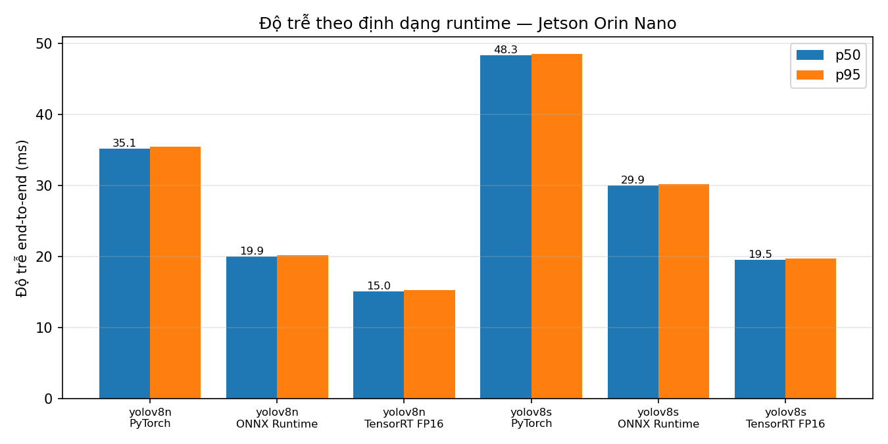
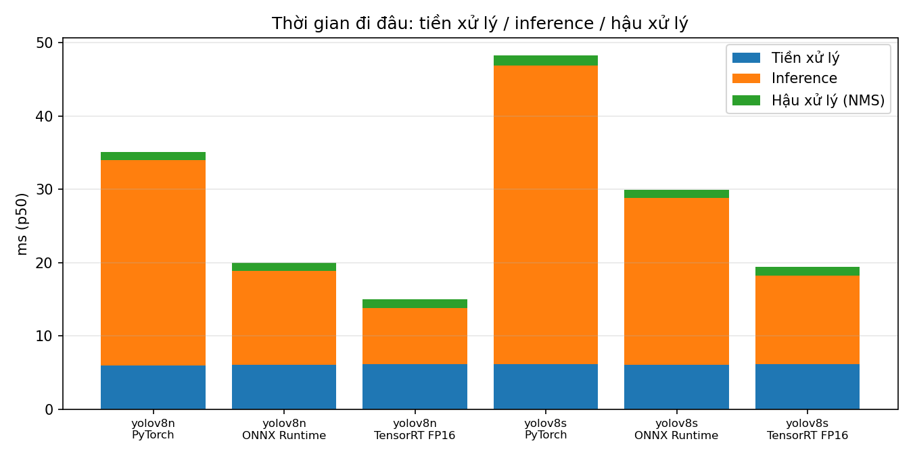
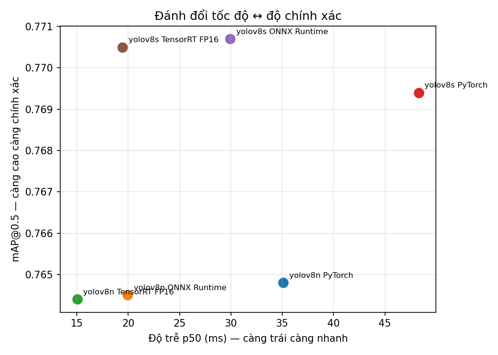

# Báo cáo benchmark — ba định dạng runtime trên Jetson Orin Nano

*Sinh tự động bởi `ivid.benchmark.report` từ `results/benchmark.json`. Số liệu đo lúc 2026-09-09T15:07:43+00:00. Mọi con số đều truy được về file JSON đó.*

## Điều kiện đo (FR-14)

| Hạng mục | Giá trị |
|---|---|
| Thiết bị | NVIDIA Jetson Orin Nano Engineering Reference Developer Kit Super |
| L4T / JetPack | R36 (release), REVISION: 5.2, GCID: 46426093, BOARD: generic, EABI: aarch64, DATE: Thu Jul 16 18:56:22 UTC 2026 / (none) |
| CUDA | Cuda compilation tools, release 12.6, V12.6.68 |
| TensorRT | 10.3.0 |
| PyTorch | 2.10.0 |
| ONNX Runtime | 1.24.0 |
| Chế độ nguồn | **15W** (id=0), các chế độ có sẵn: 15W, 25W, MAXN_SUPER |
| Nhiệt độ trung bình trước khi đo | 59.9 °C |
| Warm-up / số phiên | 20 lần / 3 phiên |
| Tập đo | 270 ảnh (test), cùng thứ tự cho mọi định dạng |

> Chế độ nguồn được cố định trong suốt phiên đo (ràng buộc C3). Đổi chế độ nguồn là đổi kết quả — mọi so sánh trong báo cáo này chỉ có giá trị ở chế độ ghi trên.

## Bảng kết quả chính

| Model | Runtime | mAP@0.5 | mAP@0.5:0.95 | p50 (ms) | p95 (ms) | FPS | Model size | RAM tiến trình | Nạp (s) |
|---|---|---:|---:|---:|---:|---:|---:|---:|---:|
| yolov8n | PyTorch | 0.7648 | 0.4401 | 35.11 | 35.47 | 28.5 | 6.3 MB | 892 MB | 3.2 |
| yolov8n | ONNX Runtime | 0.7645 | 0.4405 | 19.95 | 20.15 | 50.1 | 12.3 MB | 1846 MB | 115.4 |
| yolov8n | TensorRT FP16 | 0.7644 | 0.4405 | 15.04 | 15.26 | 66.5 | 9.1 MB | 302 MB | 0.3 |
| yolov8s | PyTorch | 0.7694 | 0.4366 | 48.28 | 48.47 | 20.7 | 22.5 MB | 945 MB | 3.1 |
| yolov8s | ONNX Runtime | 0.7707 | 0.4370 | 29.94 | 30.16 | 33.4 | 44.8 MB | 2032 MB | 179.8 |
| yolov8s | TensorRT FP16 | 0.7705 | 0.4376 | 19.45 | 19.68 | 51.4 | 25.6 MB | 326 MB | 0.4 |

## Thời gian đi đâu (FR-11)

| Model | Runtime | Tiền xử lý | Inference | Hậu xử lý (NMS) | Tổng | Inference chiếm |
|---|---|---:|---:|---:|---:|---:|
| yolov8n | PyTorch | 5.94 | 28.05 | 1.09 | 35.11 | 80% |
| yolov8n | ONNX Runtime | 6.02 | 12.82 | 1.12 | 19.95 | 64% |
| yolov8n | TensorRT FP16 | 6.12 | 7.66 | 1.26 | 15.04 | 51% |
| yolov8s | PyTorch | 6.15 | 40.73 | 1.39 | 48.28 | 84% |
| yolov8s | ONNX Runtime | 6.03 | 22.76 | 1.14 | 29.94 | 76% |
| yolov8s | TensorRT FP16 | 6.15 | 12.04 | 1.24 | 19.45 | 62% |

> Tiền xử lý và hậu xử lý dùng **cùng một hàm NumPy** cho cả ba định dạng (`ivid.preprocess`, `ivid.postprocess`). Nhờ vậy chênh lệch giữa các dòng chỉ đến từ bước inference — đúng mục đích của bảng này.

## Tài nguyên (FR-12)

| Model | Runtime | Model size | RAM tiến trình | Thời gian nạp |
|---|---|---:|---:|---:|
| yolov8n | PyTorch | 6.3 MB | 892 MB | 3.2 s |
| yolov8n | ONNX Runtime | 12.3 MB | 1846 MB | 115.4 s |
| yolov8n | TensorRT FP16 | 9.1 MB | 302 MB | 0.3 s |
| yolov8s | PyTorch | 22.5 MB | 945 MB | 3.1 s |
| yolov8s | ONNX Runtime | 44.8 MB | 2032 MB | 179.8 s |
| yolov8s | TensorRT FP16 | 25.6 MB | 326 MB | 0.4 s |

> **Con số này đo thế nào.** Mỗi runtime chạy trong một **tiến trình riêng** (`ivid.benchmark.memprobe`); giá trị là RSS đỉnh trừ RSS lúc tiến trình vừa khởi động, nên nó **bao gồm cả chi phí nạp thư viện**. Đó là chủ ý: câu hỏi triển khai là *chạy runtime này trên Jetson 8 GB tốn bao nhiêu RAM*, chứ không phải *engine chiếm bao nhiêu byte*. Jetson dùng bộ nhớ hợp nhất — CPU và GPU chia nhau cùng 8 GB DRAM, không có VRAM rời — nên đây là toàn bộ chi phí, không phải một nửa.
>
> **Hai cách đo trước đã bị loại bỏ, vì cả hai đều sai theo một kiểu riêng.** `torch.cuda.max_memory_allocated()` báo 0 MB cho ONNX Runtime (ORT tự cấp phát) và chỉ đếm buffer vào/ra cho TensorRT — ai đọc cũng sẽ kết luận *ONNX không tốn bộ nhớ GPU*, sai hoàn toàn. Cách thứ hai, đo mức tăng bộ nhớ của cả hệ thống, thì đếm luôn mọi tiến trình khác và cả bộ đệm trang: hai lần chạy cùng cấu hình cho **31.2 MB** và **0.0 MB**. Đó là nhiễu, không phải phép đo. Cả hai vẫn nằm trong `results/benchmark.json` để đối chiếu.

## Tính lặp lại (NFR-02)

| Model | Runtime | Độ lệch p50 giữa các phiên | Đạt ≤ 10%? |
|---|---|---:|:---:|
| yolov8n | PyTorch | 0.30% | ✅ |
| yolov8n | ONNX Runtime | 0.40% | ✅ |
| yolov8n | TensorRT FP16 | 0.05% | ✅ |
| yolov8s | PyTorch | 0.04% | ✅ |
| yolov8s | ONNX Runtime | 0.25% | ✅ |
| yolov8s | TensorRT FP16 | 0.07% | ✅ |

## Biểu đồ

## Kết luận (SRS §7.3)

### 0. Chi phí khởi động — chỗ bảng độ trễ không nhìn thấy

- **yolov8n**: ONNX Runtime mất **115 s** để nạp, TensorRT chỉ **0.3 s** (340× lâu hơn), và tốn **1846 MB** RAM so với **302 MB**
- **yolov8s**: ONNX Runtime mất **180 s** để nạp, TensorRT chỉ **0.4 s** (486× lâu hơn), và tốn **2032 MB** RAM so với **326 MB**

ONNX Runtime ở đây chạy `TensorrtExecutionProvider`, nghĩa là nó **tự dựng engine TensorRT ngay lúc nạp model** — và dựng lại từ đầu mỗi lần tiến trình khởi động, vì bộ nhớ đệm engine chưa được bật. Trên dây chuyền, mỗi lần khởi động lại dịch vụ (mất điện, cập nhật, container bị lên lịch lại) là ngần ấy giây không kiểm được sản phẩm.

Đây là lý do chọn định dạng không thể chỉ nhìn cột p50: ba runtime có độ trễ cùng bậc, nhưng chi phí khởi động lệch nhau hai bậc. Muốn dùng ONNX Runtime thì phải bật `trt_engine_cache_enable` và nung sẵn bộ nhớ đệm lúc đóng gói image; còn engine `.plan` dựng sẵn thì nạp thẳng trong 0.3 s.

### 1. TensorRT FP16 nhanh hơn PyTorch bao nhiêu, đổi lấy bao nhiêu mAP?

- **yolov8n**: nhanh hơn **2.33×** (35.11 ms → 15.04 ms), mAP@0.5 0.7648 → 0.7644 (**-0.0004**, -0.1%) — gần như không mất độ chính xác
- **yolov8s**: nhanh hơn **2.48×** (48.28 ms → 19.45 ms), mAP@0.5 0.7694 → 0.7705 (**+0.0011**, +0.1%) — gần như không mất độ chính xác

### 2. Với nhịp dây chuyền 200 ms/sản phẩm, cấu hình nào đáp ứng?

Dùng **p95** chứ không phải p50: dây chuyền hỏng vì trường hợp chậm nhất, không phải vì trường hợp trung bình.

| Cấu hình | p95 (ms) | Đáp ứng? | Nhịp nhanh nhất chịu được |
|---|---:|:---:|---:|
| yolov8n / TensorRT FP16 | 15.26 | ✅ | 65.5 sp/giây (15 ms) |
| yolov8s / TensorRT FP16 | 19.68 | ✅ | 50.8 sp/giây (20 ms) |
| yolov8n / ONNX Runtime | 20.15 | ✅ | 49.6 sp/giây (20 ms) |
| yolov8s / ONNX Runtime | 30.16 | ✅ | 33.2 sp/giây (30 ms) |
| yolov8n / PyTorch | 35.47 | ✅ | 28.2 sp/giây (35 ms) |
| yolov8s / PyTorch | 48.47 | ✅ | 20.6 sp/giây (48 ms) |

**Khuyến nghị: `yolov8s / TensorRT FP16`** — mAP@0.5 0.7705, p95 19.68 ms, còn dư **180 ms** biên an toàn cho chụp ảnh, truyền dữ liệu và dao động tải.
  Các cấu hình `yolov8s / PyTorch`, `yolov8s / ONNX Runtime` có mAP chênh dưới 0.005 so với cấu hình tốt nhất nhưng chậm hơn, nên không được chọn.

### 3. YOLOv8s có đáng đổi độ trễ lấy mAP không?

- Trên TensorRT FP16: YOLOv8s chậm hơn **+4.41 ms** (+29%) và cho mAP@0.5 **+0.0061**.
- Đổi lại: mỗi **+0.001 mAP** tốn thêm **0.72 ms**.
- **Không đáng — và chặt hơn thế: hai model không phân biệt được.** |+0.0061| nhỏ hơn ngưỡng nhiễu **0.0115** đo được từ hai lần train YOLOv8n *cùng seed* (`docs/reproducibility.md`). Chênh lệch nằm dưới mức mà chính quy trình train tái lập được, nên không thể quy cho model lớn hơn. YOLOv8s có **3.7× tham số** nhưng không mua được độ chính xác nào đo được — 1260 ảnh train là quá ít để 11.1M tham số phát huy.

## mAP theo lớp

| Cấu hình | `crazing` | `inclusion` | `patches` | `pitted_surface` | `rolled-in_scale` | `scratches` |
|---|---:|---:|---:|---:|---:|---:|
| yolov8n / PyTorch | 0.458 | 0.807 | 0.956 | 0.817 | 0.601 | 0.950 |
| yolov8n / ONNX Runtime | 0.451 | 0.807 | 0.956 | 0.820 | 0.603 | 0.950 |
| yolov8n / TensorRT FP16 | 0.451 | 0.807 | 0.956 | 0.820 | 0.604 | 0.949 |
| yolov8s / PyTorch | 0.421 | 0.833 | 0.957 | 0.826 | 0.623 | 0.957 |
| yolov8s / ONNX Runtime | 0.429 | 0.835 | 0.957 | 0.826 | 0.621 | 0.957 |
| yolov8s / TensorRT FP16 | 0.428 | 0.835 | 0.957 | 0.826 | 0.621 | 0.956 |

> Lớp nào thấp hẳn thì xem `docs/dataset.md`: `pitted_surface` có khung phủ hơn nửa ảnh và `crazing` là dạng vết nứt lan toả không có biên rõ — mAP thấp ở các lớp này là đặc tính dataset, không phải lỗi pipeline.

